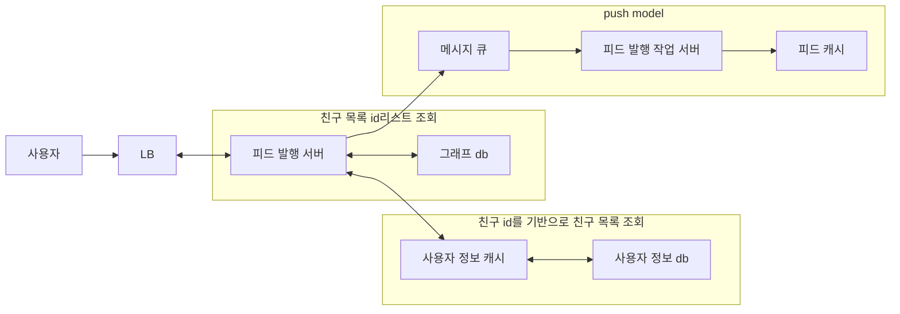

# 요약

## 뉴스 피드 시스템

- 피드 시스템: 사용자와 관련된 정보들을 제공. 지속적으로 갱신됨
  - sns: 팔로우한 사용자의 최신 게시물

## 새끼 문제로 나누기

- 피드시스템은 2가지 시스템으로 구성된다.
  1. 피드를 발행하는 시스템
  2. 피드를 제공하는 시스템

## 설계시 고려사항

### fanout-on read vs fanout-on write

- fanout-on read(pull model): 피드를 읽는 시점에 부하를 주는 모델
  - 비활성화된 사용자 수가 많을 경우에 유리 => 활성화된 사용자들이 피드를 조회할 때만 read가 발생
  - 피드를 읽을 때 다른 사용자가 쓴 피드를 가져옴
  - hotspot key문제가 없음
  - 피드를 읽기위한 시간이 오래걸림
- fanout-on write(push model): 피드를 쓰는 시점에 부하를 주는 모델
  - 피드를 발행할 때 관련된 사용자들에게도 피드를 발행
  - 피드의 실시간 갱신이 가능
  - 자주 사용하지 않는 사용자에게도 write가 발생
  - hotspot key문제 발생: 친구수가 많은 사용자일 경우 write가 많이 발생
- 책의 해결책: 피드를 빠르게 읽는 것이 중요하기에 일반 사용자는 push model을 이용해 피드를 발행하고 팔로우수가 많은 사용자는 pull model을 이용해 피드를 조회하는 시점에 부하를 주는 방식으로 설계

## 피드 발행 시스템 



1. 사용자가 피드 발행을 요청
2. 피드 발행 서버는 그래프 db에서 연관되어 있는 친구 id리스트를 조회
3. 친구 id를 기반으로 피드 발행을 보낼 친구 목록들을 조회 및 필터링
4. 친구 id, 포스팅 id로 메시지 큐에 피드 발행 요청
5. 피드 발행 작업 서버는 메시지 큐에서 피드 발행 요청을 받아 피드를 발행 
6. 피드 발행 작업 서버는 피드를 발행한 사용자의 피드 캐시에 피드를 저장
 
## 피드 제공 시스템

````mermaid
graph TD
A[사용자] --> B[LB]
B <--> C[피드 제공 서버]
subgraph 피드 조회
  C <--> F[피드 캐시]
  F <--> G[피드 db]
end
subgraph 포스트 조회
  C <--> D[포스트 캐시]
  D <--> E[포스트 db]
end
subgraph 사용자 정보 
  C <--> H[사용자 정보 캐시]
  H <--> I[사용자 정보 db]
end
````

1. 피드 제공 서버에서 피드 캐시에서 조회할 포스트 id들을 가져옴
2. 피드 제공 서버가 포스트 id들을 기반으로 포스트 캐시에서 포스팅 정보들을 가져옴
3. 피드 제공 서버가 포스트를 작성한 사용자 정보를 사용자 db에서 가져온다
4. 이를 조합해서 사용자에게 반환

## 이외의 고려사항

- scale-out, scale-up
- SQL vs NoSQL
- consistency model
- sharding
- 핵심 매트릭 모니터링
- 메시지 큐를 이용한 컴포넌트 결합도 낮추기
- 