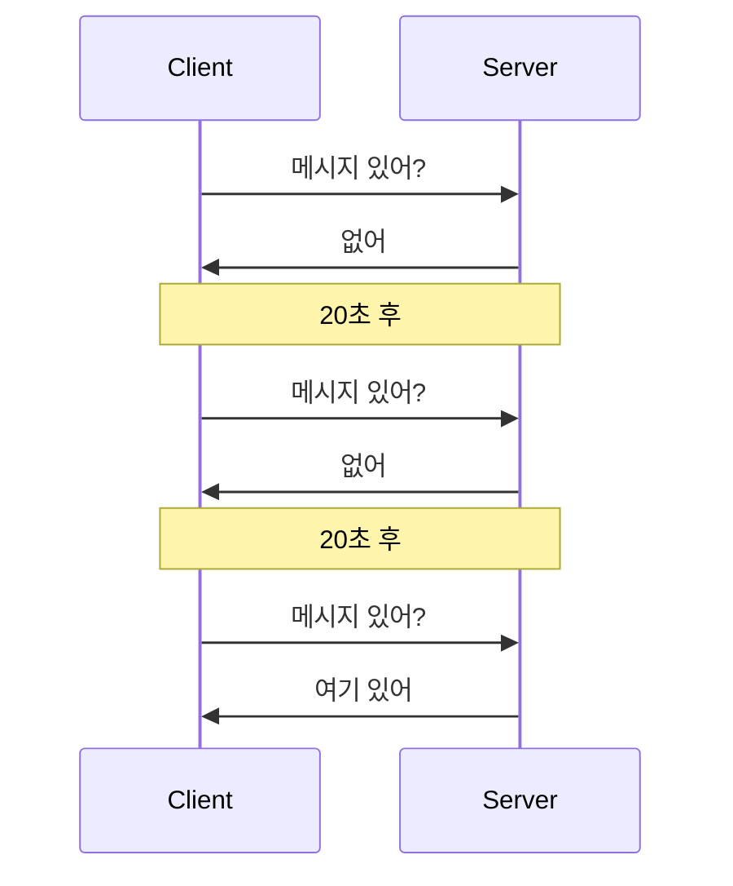
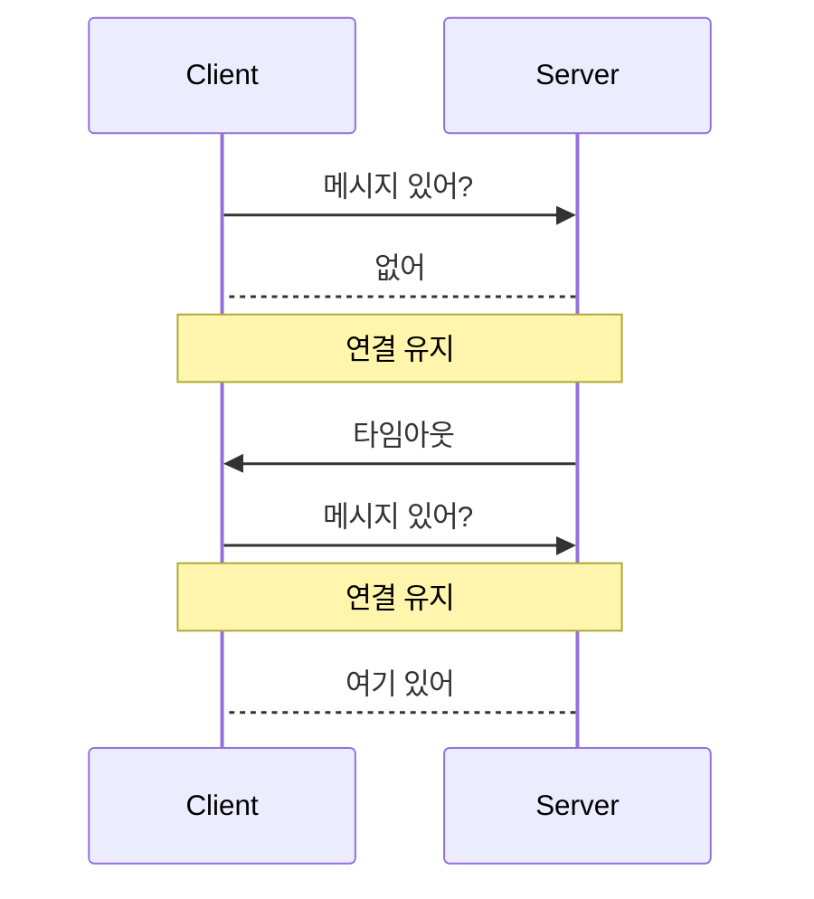
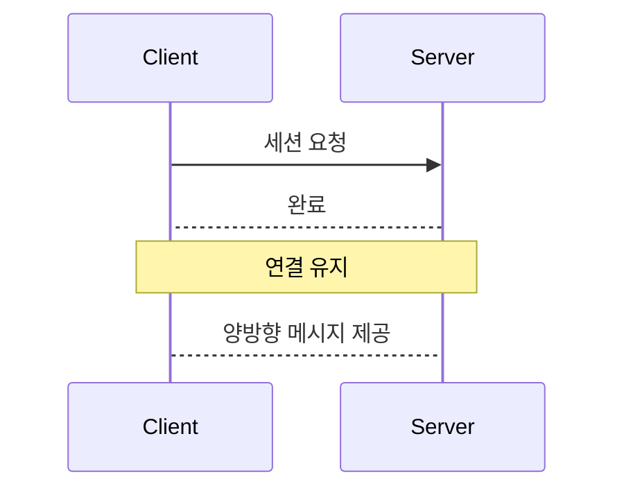
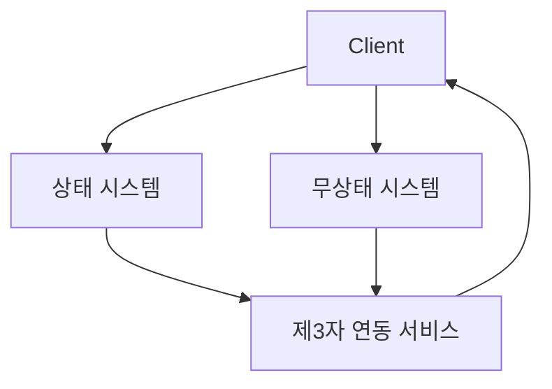
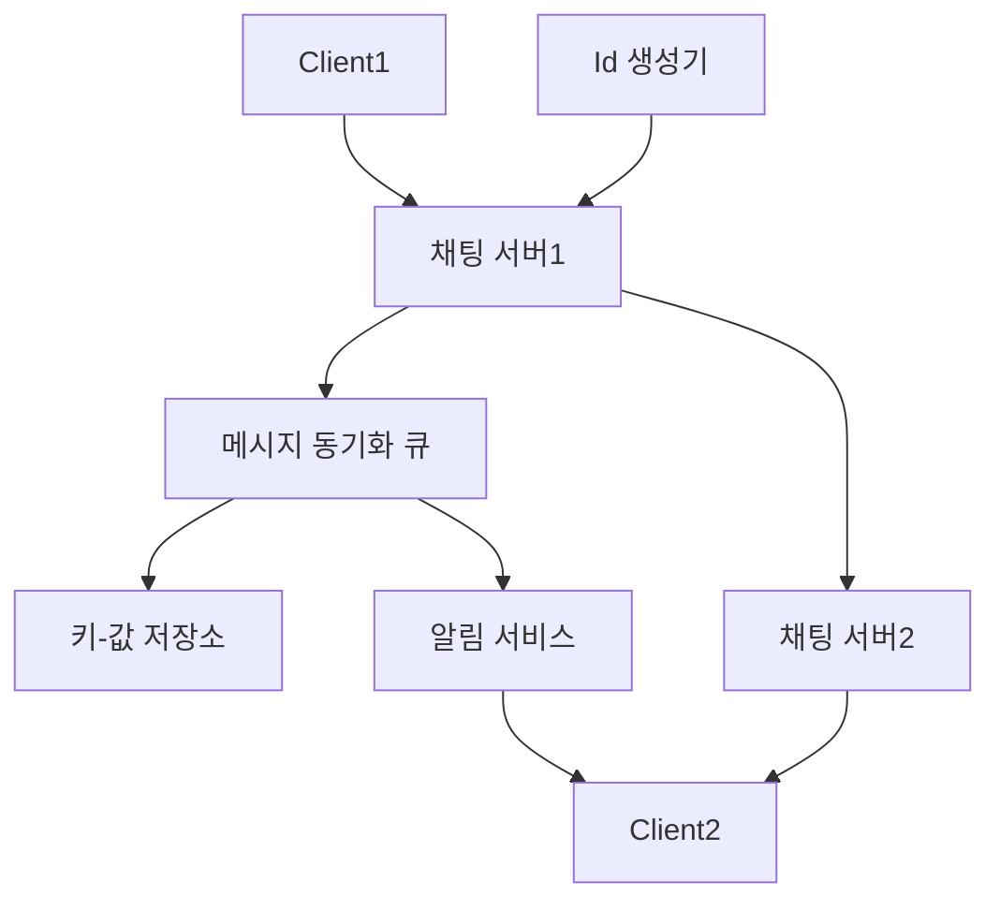
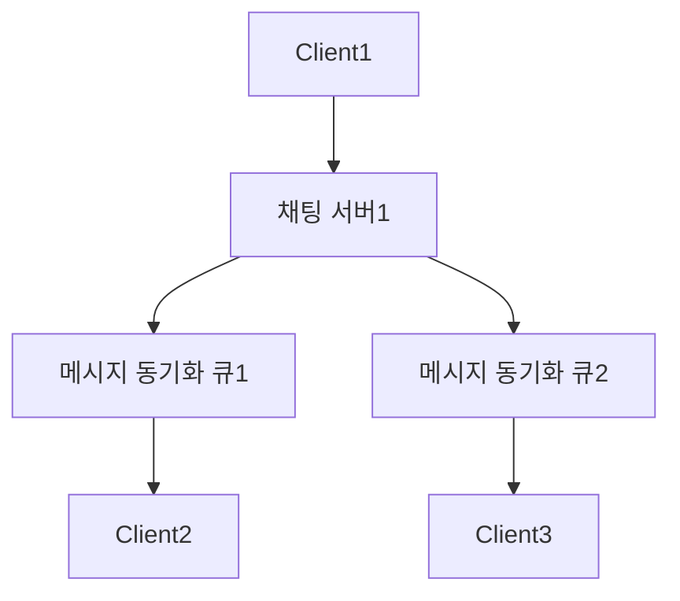

# 요약

## 채팅 시스템 설계

- 채팅 시스템은 서비스의 요구사항에 따라 여러가지가 나온다
  - 그룹 채팅은?
  - 1대 1채팅은?
  - 채팅 기록의 저장은 하며 보관 기간은 얼마인가
  - 지원해야 하는 기기는 어떤 것인가 등
- 채팅 시스템의 기본 기능
  - 클라이언트는 메시지를 보낸다
  - 서버는 메시지를 저장한다
  - 서버는 클라이언트가 접속 중인지를 확인하고 접속 중이면 메시지를 보낸다.

## 메시지를 전달하는 프로토콜

### Polling

- 클라이언트가 서버에게 주기적으로 요청을 보내는 방식
- 주로 안정성이 검증된 http프로토콜을 이용
  - keep-alive설정을 이용해 tcp handshake 횟수를 줄이는 최적화가 가능
- polling을 하는 주기가 짧을 수록 속도는 빠르나 서버에 부하가 걸린다

### Long Polling

- polling을 길게 잡는 전략
- 서버가 메시지를 보내지 않으면 클라이언트는 타임아웃이 발생할 때까지 연결을 유지
- polling방식에 비해 tcp세션을 잡는 회수가 적음
- 문제점
  1. 메시지를 받을 때까지 세션을 유지하기에 비효율적이다
  2. http는 기본적으로 stateless하기에 여러 서버가 있을 경우 세션을 맺은 서버에 응답받을 메시지가 저장되어있다는 보장이 없다

### Web Socket

- 초반에 http세션을 맺고 이후에는 웹소켓으로 업데이트
- 양방향 메시징이 가능
- 설계가 단순하고 직관적임

## 설계안

- 채팅 서비스를 제공하는 시스템은 아래의 서브시스템으로 나누어진다
  - 무상태 시스템: 로그인, 회원가입 등 상태를 유지할 필요가 없는 기능을 제공하는 시스템
  - 상태 시스템: 채팅을 구현해야하는 서비스, 서버가 누구인지 알고 연결을 유지시켜야하는 서비스
  - 제3자 연동 서비스: 채팅을 보냈으면 이를 수신자에게 알리기 위한 알림 서비스
- 채팅 데이터를 저장하기 위해 key-value db를 이용한다
  - 채팅의 데이터를 오래된 데이터가 많지만 대부분 최근 채팅을 본다 => long tail
  - 전통적인 rdb는 long tail 부분의 데이터 처리가 어렵기에 key-value db를 이용
- key는 정렬된 상태를 유지한다. 이는 채팅의 순서를 보장하기 위함

### Service Discovery

- 로그인 후에 채팅을 보내기 위해 채팅 서버에 연결이 필요
- 채팅 서버는 여러개이나 상태를 유지해야하는 특성이 존재
- 로그인을 하면 사용자가 채팅을 시도할 최적의 서버를 선택해서 제공 => Service Discovery의 역할

### 1대1 메시지 전송

1. 사용자가 채팅을 채팅 서버에 보냄
2. 채팅 서버는 id 생성기를 통해 메시지에 id를 부여
3. 메시지 동기화 큐로 메시지를 전달
4. 메시지는 키-값 저장소에 저장
5. 수신자 접속 여부에 따라 다음의 동작을 수행
6. 접속 중: 즉시 채팅서버2로 전송
7. 미접 속: 알림 서비스에 채팅이 왔다는 알림을 보내는 명령 후 채팅서버2에 전달
8. 채팅 서버2는 수신자가 접속해있으면 전달

### 여러 단말을 사용하는 경우의 설계(메시지 동기화 프로세스)

- 카카오톡처럼 같은 사용자지만 컴퓨터, 핸드폰, 태블릿 등 여러 기기를 사용하는 경우에 메시지를 동기화하는 과정이 필요
- 각 단말에는 메시지를 어디까지 읽었는지를 추적하는 id를 가진다.
- 각 단말은 같은 채팅 서버 혹은 다른 채팅 서버에 연결되어있을 수 있다.
- 추적 id값은 key-value db에서 사용되는 key값
- 추적 id값이 db에 저장된 값보다 작으면 이 간격에 있는 key들의 데이터가 동기화되지 못한 메시지의 개수

### 그룹 채팅

- 1대1채팅은 수신자가 정해져있으나 그룹 채팅은 다수가 수신자
- 메시지를 수신받을 수 있는 전용 메시지 큐를 할당받아 사용
- 수신자 입장에서는 할당받은 메시지 큐만 바라보면 되기 때문에 메시지 동기화가 유리함
- 그룹의 개수가 크면 메시지 동기화 큐의 개수가 많아져서 관리가 어려워짐

1. 사용자는 채팅서버에 메시지를 전달
2. 채팅 서버는 그룹에 속한 수신자들에게 할당된 메시지 큐에세 메시지를 전달
3. 그룹에 속한 사용자는 메시지 큐에서 메시지를 수신

