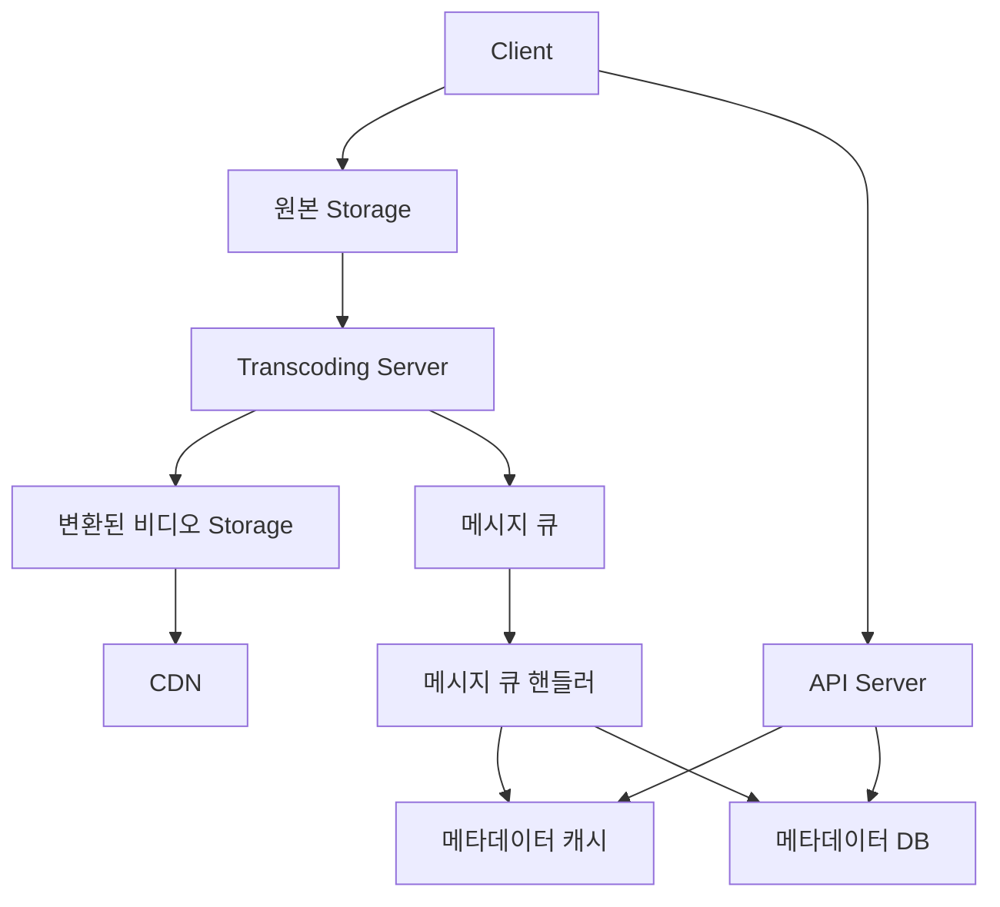

# 유튜브 설계 시스템

## 가정

- DAU: 500만
- 사용자는 매일 5개의 동영상을 시청
- 다국어 지원
- 비디오 사이즈: 0.3GB
- 10%의 사용자는 새로운 영상 1개를 올림

## 개략적인 설계

다국어 지원이라 CDN을 고려할 수 있다. 그러나 단순히 CDN을 사용하면 비용이 많이 발생한다. 그렇기에 CDN의 비용을 줄이면서 사용자의 요청을 감내하는 것이 유튜브 설계의 중요점이다

### video transcoding 

- 비디오 인코딩이라고도 불리우며 인코딩 과정에서 데이터 포맷 변환, 압축 등이 가능
- 이점
  - 압축을 통해 저장되는 비디오 크기를 최소화
  - 특정 비디오 포맷만 지원하는 기기에 영상 제공 가능
  - 사용자의 네트워크 상태에 따라 비디오 품질을 조절 가능
  - 모바일처럼 네트워크 환경이 수시로 바뀌는 환경에 대응이 유리

## 설계

1. 클라이언트는 스토리지에 원본 영상을 올림
2. 울린 영상을 transcoding server가 받아서 다양한 포맷으로 변환하여 별도의 스토리지에 저장
3. 변환이 완료되면 아래의 2작업을 동시에 진행
   - CDN에 배포하는 작업
   - 변환이 완료되었다는 메시지를 보내 메타데이터 캐시와 DB를 변경
4. 클라이언트는 API 서버를 통해 비디오 업로드가 완료되었음을 확인
