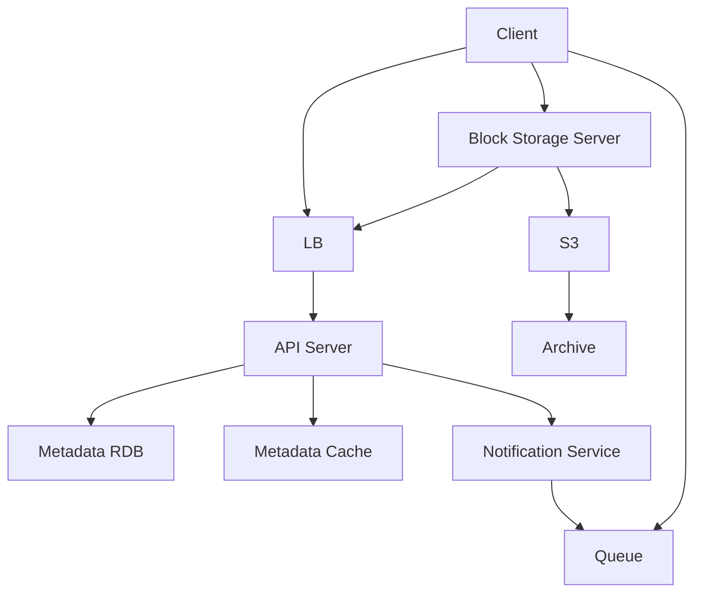

# 구글 드라이브 설계

## 설계 사항
  

- Block Storage Server: 파일을 블록 단위로 나누어서 클라우드 저장소(S3)에 저장하는 역할
  - 블록 단위로 나누는 이유: 큰 단일 파일 1개가 올라가면 네트워크 트래픽을 파일 1개가 먹기 때문.
  - 서버가 있으므로 압축, 델타동기화가 유리
  - 델타 동기화: 파일이 수정되면 전체가 아닌 일부만 수정 => 블록으로 나누어져 있기에 블록 부분만 수정
- Archive: 접근이 안되는 데이터를 접근하기 위한 저장소
- Notification Service: 파일의 상태를 큐잉하여 클라이언트가 접속을 할 때 최신 상태로 동기화를 하는 기능

