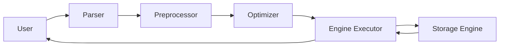

# 물리 엔진과 Object

- Storage Engine: 디스크나 메모리에서 필요한 데이터를 가져오는 역할
  - MyISAM, InnoDB, Memory 등
  - OLTP 환경이 대다수이기에 일반적으로 InnoDB엔진을 사용
- MySQL Engine: 사용자가 요청한 SQL문을 검사하고 Storage Engine에게 명령을 내려 데이터를 조회

## SQL 동작 프로세스

### 구성요소

- Parser: SQL 문법을 검사해 트리를 생성
- Preprocessor: 트리의 구조적 문제를 파악
  - 존재하는 테이블, 뷰를 접근하는가
  - 접근 권한이 존재하는가
- Optimizer: 연산 과정을 최적화
  - 실행 계획을 수립하는 역할
  - 인덱스만으로 연산이 종료되는가
  - 정렬시 임시테이블을 사용할 것인가
  - Optimizer의 결정이 최적이 아닐 경우 힌트를 통해 유도
- Engine Executor
  - MySQL Engine, Storage Engine영역 사이에 있는 구성요소
  - MySQL Engine이 Storage Engine에게 명령을 내려 데이터를 조회

### 동작 과정




## Object요소

- table: db를 저장하는 객체
  - 저장 방식에 따라 엔진 속성을 정의
- row(행): 데이터 항목의 집합
- column(열): 데이터의 유형
- primary key(PK): row를 대표하는 column
   - clustered index로 구성되기에 PK순서대로 물리적 스토리지에 적재
- foregin key(FK): 외부에 있는 테이블을 참조하는 키, 외부 테이블의 값이 영향을 받으면 FK도 영향을 받음
- index: 데이터를 빠르게 조회하기 위해 사용되는 객체
  - Unique Index: index를 구성하는 열들의 데이터가 유일한 값들을 가짐
    - 값을 생성할 때 이미 테이블에 존재하는 값인지 검증
  - Non-Unique Index: index를 구성하는 열들의 데이터가 중복될 수 있는 값들을 가짐
    - 중복 체크를 수행하지 않고 정렬 작업만 수행
- view: 테이블을 기반으로 생성되는 가상 테이블
  - 이점: 민감한 데이터 노출을 방지

# 논리적인 SQL개념 용어

## 서브 쿼리 위치에 따른 명칭

```sql
SELECT (scala subquery...)
FROM (inline view)
WHERE (nested subquery)
```

- scalar subquery: 단일행, 단일열의 결과를 반환하는 서브 쿼리만 사용 가능
- inline view: 일시적으로 만들어지는 뷰. 결과가 메모리 혹은 디스크에 작성
- nested subquery: 서브 쿼리로 조건을 비교할 때 사용
  - `IN`, `NOT IN`, `EXISTS`, `NOT EXISTS` 연산자들을 사용 가능

## 메인 쿼리의 관계성에 따른 SQL용어

### 비상관 쿼리

```sql
SELECT name
FROM account
WHERE id IN (SELECT id FROM account WHERE id<100);
```
- subquery 조희시 메인 쿼리와의 관계성이 없다
  - subquery만으로 독단적으로 실행이 가능한 쿼리
- 쿼리 실행 순서: subquery -> 메인 쿼리

### 상관 쿼리

```sql
SELECT name
FROM account AS a
WHERE id IN (SELECT id FROM rank_board WHERE id=a.id);
```
- subquery 조희시 메인 쿼리와의 관계성이 있다
  - subquery가 메인 쿼리의 결과에 영향을 받는 쿼리
- 쿼리 실행 순서: 메인 쿼리 -> subquery -> 메인 쿼리

## 반환 결과에 따른 SQL 용어

### single-row subquery

```sql
SELECT name
FROM account
WHERE id=(SELECT id FROM account WHERE id=100);
```

- 서브 쿼리 결과가 단건인 경우

### multi-row subquery

```sql
SELECT name
FROM account
WHERE (id, name) IN (SELECT id, name FROM account WHERE id<100);
```

- 서브 쿼리 결과가 복수건인 경우


## join 방식 용어

- left join 혹은 

### inner join

```sql
SELECT a.name, b.score
FROM account AS a
INNER JOIN rank_board AS b
ON a.id=b.id;
```

- join을 수행하는 컬럼의 값중에 중복되는 쿼리

### left outer join(left join)

```sql
SELECT a.name, b.name
FROM account AS a
LEFT OUTER JOIN rank_board AS b
ON a.id=b.id;
```

- join을 수행하는 컬럼 중에 왼쪽 테이블에 위치하는 값을 위주로 join
  - 만약 존재하지 않으면 NULL을 반환

### right outer join(right join)

```sql
SELECT a.name, b.score
FROM account AS a
RIGHT OUTER JOIN rank_board AS b
ON a.id=b.id;
```

- join을 수행하는 컬럼 중에 오른쪽 테이블에 위치하는 값을 위주로 join
  - 만약 존재하지 않으면 NULL을 반환

### cross join

```sql
SELECT a.name, b.score
FROM account AS a
CROSS JOIN rank_board AS b;
```

- 두 테이블의 모든 행을 조합하여 반환
- 테이블을 cartesian product로 조합
- 모든 조합을 찾아낼 수 있으나 리소스가 많이 소모되는 join

### naturnal join

```sql
SELECT a.name, b.score
FROM account AS a
NATURAL JOIN rank_board AS b;
```

- 두 테이블에 column 명이 같은 column이 존재할 때 별도의 조건 서술 없이 join을 해주는 방식
- column의 타입은 달라도 수행
- join조건을 알아서 찾기에 `ON` 을 통한 조건 명세시 에러가 발생

## join 알고리즘

### driving table, driven table

- join시 테이블을 동시에 접근할 수 없기에 우서눗ㄴ위가 존재
- driving table: 먼저 검색되는 테이블
- driven table: driving 테이블을 이용해 데이터를 검색하는 테이블

### nested loop join(NL Join)

- driven table을 반복적으로 검색하여 join 하는 방식
- Non-Unique index를 이용할 경우 random access가 발생
- PK기반의 조회시 효율적

### block nested loop join(BNL Join)

- NL Join의 성능을 향상시킨 방식
- driving table을 조회한 결과를 join buffer로 만들어 메모리에 적재 후  join buffer와 driven table끼리 join 하는 방식
- table full scan 1번으로 
- block hash join 도 방식은 비슷
  - hash를 적용해 join을 하는 것이 다름

### batached key access join(BKA Join)

- random access 방식을 개선하고자 접근하고자 하는 데이터를 미리 예상해 가져오는 방식
- 순서
  1. driving table을 이용해 join buffer를 만들고 
  2. MRR(Multi-Range Read)을 이용해 driven table을 읽어옴 -> sequence access를 수행해 한번에 가져옴
     - 가져온 데이터는 정렬되어 있음
  3. join buffer와 MRR를 이용해 join

### hash join

- MySQL 8.0.18부터 지원되는 방식
- 테이블 내부에 해시값을 만들어 inner join을 수행
- join 결과는 join buffer에 저장되어 index가 필요 없음

# 개념적인 튜닝 용어

## Object Scan 유형

### Full Table Scan

- 테이블을 스캔하여 모든 데이터를 가져오는 방식
- 인덱스 없이 사용되는 유일한 검색 방식

### index range scan

- index에서 범위를 탐색한 후 테이블에서 데이터를 찾아가는 방식

### index full scan

- 테이블 접근 없이 index 스캔만으로 데이터를 탐색

### index unique scan

- PK나 unique index로 테이블에서 데이터를 조회

### index loose scan

- index에서 필요한 부분만 골라 scan 후 테이블 탐색
- `GROUP BY`, `MAX`, `MIN` 이 사용시 동작

### index merge scan

- 여러개의 index를 이용해 데이터를 탐색


## disk 접근 방식

- sequential access: 인접한 페이지 순서대로 읽는 방법
  - 디스크의 움직임을 최소화하는 읽기 방법
- random access: 임의의 페이지게 접근하여 읽는 방식
  - 페이지는 순차적으로 접근하나 저장된 위치가 순차적이지 않아 랜덤으로 액세스

  
## 조건문 유형

- access condition: 데이터를 접근하는 조건
  - PK를 이용해 접근하였을 때 index를 이용해 접근해야하는 row들을 설정
- filter condition: 데이터를 읽을 때 불필요한 데이터를 제거, 가공하는 조건
  - 접근한 row중에 불필요한 데이터는 제거하는 조건
  - filter condition에 걸러지는 것보단 storage engine에서 제거하는 것이 좋음

# 응용 용어

## selectivity

- 쿼리문의 실행 결과로 선택된 row의 비율
- selectivity가 낮다: 원하는 데이터만 찾을 수 있다.
- 선택도 공식
  - 선택된 데이터 건수/ 전체 데이터 건수
  - 1/중복이 제거된 데이터 건수

## cardinality

- 하나의 데이터 유형으로 정의되는 데이터 row의 개수
- cardinality가 높다: 데이터의 분포가 넓다
- cardinality공식: 전체 데이터 건수 * selectivity

## hint

- optiminzer에게 최적화 힌트를 직접 내리는 것
- optimizer가 hint가 비효율적이라고 생각하면 무시함
- hint의 종류
  - straight_join: join의 순서를 테이블 작성 순서로 유도
  - use_index: index를 사용하도록 유도
  - force_index: index를 강제로 사용하도록 유도
  - ignore_index: index를 사용하지 않도록 유도

## collation

- 문자셋에 따라 데이터를 비교, 정렬하는 규칙
- utf8_bin의 순서: A,B...a,b,...
- utf8_general_ci의 순서: A,a,B,b,...
- 테이블, 열단위까지 지정이 가능

## 통계 정보

- optimizer가 통계를 기반으로 실행 계획을 수립

### 통계정보 얘시: histgram

- histgram: 데이터의 분포를 표현하는 그래프
- column이 어떻게 분포되어있는지를 확인
- MySQL은 height balanced histogram을 이용
  - 데이터를 그룹화하고 bucket만큼 분리해 통계 정보를 저장